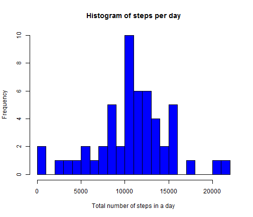
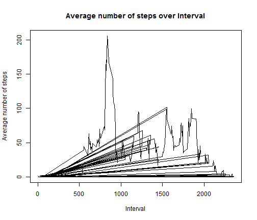
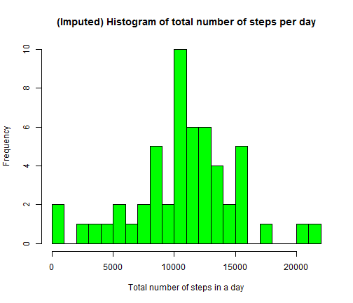
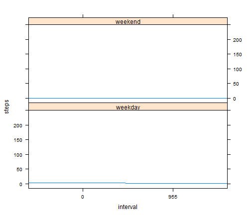

**Reproducible Research Peer Assessment 1----Joseph Chatman**


========================================================

Show any code that is needed to

Load the data (i.e. read.csv()).

Process/transform the data (if necessary) into a format suitable for your analysis.


```r
data.source <- read.csv("activity.csv", colClasses = "character")
df<-na.omit(data.source)
```

**What is mean total number of steps taken per day?**

For this part of the assignment, you can ignore the missing values in the dataset.

Make a histogram of the total number of steps taken each day.

Calculate and report the mean and median total number of steps taken per day.
You can also embed plots, for example:


```r
df$steps= as.numeric(df$steps)
stepsPerDay <- aggregate(steps ~ date, df, sum)
hist(stepsPerDay$steps, breaks = 20, col = "blue", main = "Histogram of steps per day",xlab="Total number of steps in a day")
```

 

```r
mean(stepsPerDay$steps)
```

```
## [1] 10766
```

```r
median(stepsPerDay$steps)
```

```
## [1] 10765
```
**What is the average daily activity pattern?**

Make a time series plot (i.e. type = "l") of the 5-minute interval (x-axis) and the average number of steps taken, averaged across all days (y-axis)

Which 5-minute interval, on average across all the days in the dataset, contains the maximum number of steps?

```r
data.source <- read.csv("activity.csv", colClasses = "character")
df<-na.omit(data.source)
df$steps= as.numeric(df$steps)
stepsPerInt<-aggregate(steps ~ interval, df, mean)

plot(stepsPerInt$interval, stepsPerInt$steps, type='l', 
     main="Average number of steps over Interval", xlab="Interval", 
     ylab="Average number of steps")
```

 

```r
# find row id of maximum average number of steps in an interval
rowID <- which.max(stepsPerInt$steps)

# get the interval with maximum average number of steps in an interval
stepsPerInt [rowID, ]
```

```
##     interval steps
## 272      835 206.2
```

```r
df_NA <- data.source[!complete.cases(data.source),]

# number of rows
nrow(df_NA)
```

```
## [1] 2304
```
**Imputing missing values**

Note that there are a number of days/intervals where there are missing values (coded as NA). The presence of missing days may introduce bias into some calculations or summaries of the data.

1.Calculate and report the total number of missing values in the dataset (i.e. the total number of rows with NAs)

2.Devise a strategy for filling in all of the missing values in the dataset. The strategy does not need to be sophisticated. For example, you could use the mean/median for that day, or the mean for that 5-minute interval, etc.

~For performing imputation, we replace the NA by the mean for that 5-minute interval. We create a new dataset dfnew to hold the imputed information.

We loop across the rows of the data frame "dfnew". If the steps value is NA for a row, we find the corresponding value of interval, and then replace the NA value.


3.Create a new dataset that is equal to the original dataset but with the missing data filled in.

4.Make a histogram of the total number of steps taken each day and Calculate and report the mean and median total number of steps taken per day. Do these values differ from the estimates from the first part of the assignment? What is the impact of imputing missing data on the estimates of the total daily number of steps?

```r
# perform the imputation
dfnew<-df
for (i in 1:nrow(dfnew)){
        if (is.na(dfnew$steps[i])){
                interval_val <- dfnew$interval[i]
                row_id <- which(table_interval_steps$interval == interval_val)
                steps_val <- table_interval_steps$steps[row_id]
                dfnew$steps[i] <- steps_val
        }
}
dfnew$steps= as.numeric(dfnew$steps)


# create histogram of total number of steps in a day
stepsPerDayNew <- aggregate(steps ~ date, dfnew, sum)
hist(stepsPerDay$steps, breaks = 20, col="green", main="(Imputed) Histogram of total number of steps per day", xlab="Total number of steps in a day")
```

 

```r
mean(stepsPerDayNew$steps)
```

```
## [1] 10766
```

```r
median(stepsPerDayNew$steps)
```

```
## [1] 10765
```

**Because of the data imputation the mean and median stay approximately the same.**

**Are there differences in activity patterns between weekdays and weekends?**


```r
df[, 4] <- "weekday"
names(df)[4] <- "isWeekend"
head(df)
```

```
##     steps       date interval isWeekend
## 289     0 2012-10-02        0   weekday
## 290     0 2012-10-02        5   weekday
## 291     0 2012-10-02       10   weekday
## 292     0 2012-10-02       15   weekday
## 293     0 2012-10-02       20   weekday
## 294     0 2012-10-02       25   weekday
```

```r
for (i in 1:dim(df)[1]) {
        wd <- weekdays(as.Date(df$date[i]))
        if (wd == "Sunday" | wd == "Saturday") {
                df$isWeekend[i] <- "weekend"
        }
}

df$isWeekend <- as.factor(df$isWeekend)

stepsPerIntNew<- aggregate(steps ~ interval + isWeekend, df, 
                                   mean)
library(lattice)
```

```
## Warning: package 'lattice' was built under R version 3.1.1
```

```r
xyplot(steps ~ interval | isWeekend, stepsPerIntNew, layout = c(1, 2), 
       type = "l")
```

 
